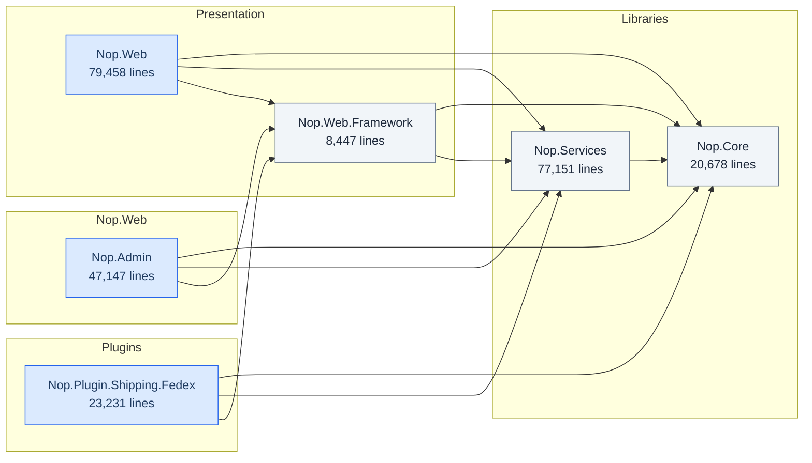
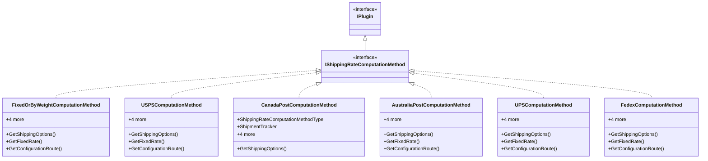
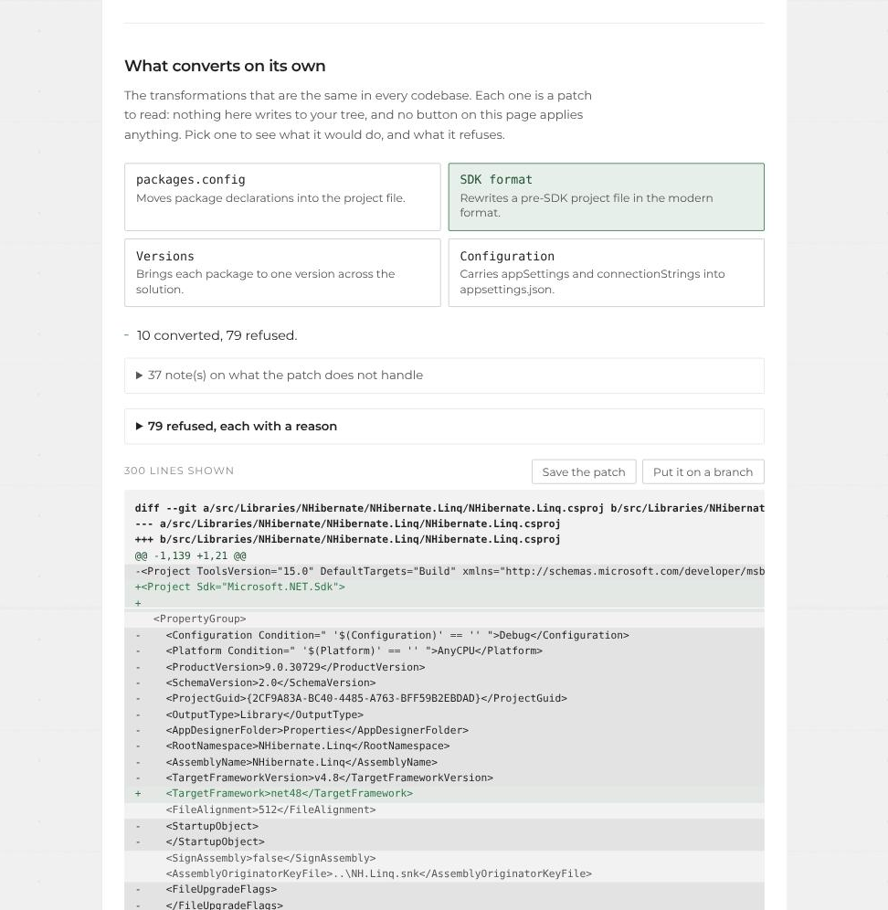
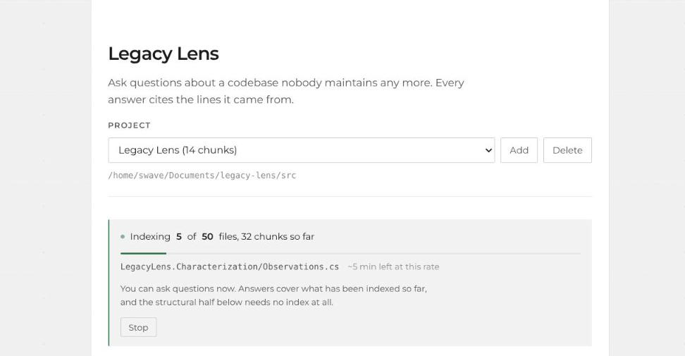
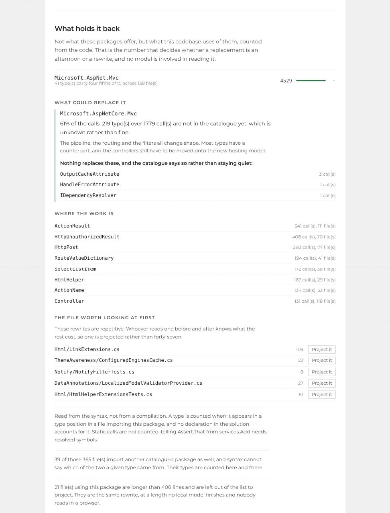
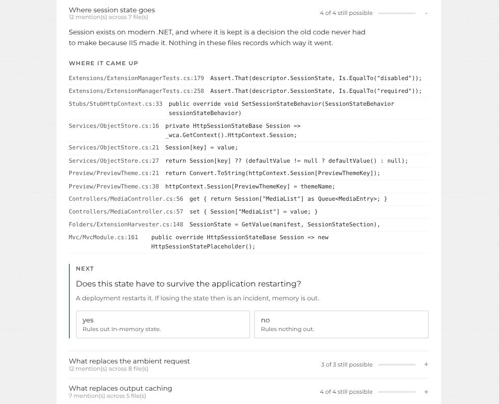

# Legacy Lens

Ask questions about a codebase nobody maintains any more.

Point it at a repository. It reads the source, indexes it, and answers questions
in plain language with a citation for every claim: file and line numbers you can
open and check.


*Answering a question about its own source. Every claim carries the file and lines
it came from, with the retrieval score beside it.*

Or from the command line:

```
> Where is the pricing calculated?

Pricing is computed in Billing/PriceEngine.cs (lines 84-131). The base rate comes
from the customer tier, then two discounts are applied in sequence: volume, then
contractual. The contractual discount is read from an XML file loaded at startup
in Startup.cs:47, which is why changing it requires a restart.

  Billing/PriceEngine.cs:84-131   (0.81)
  Billing/DiscountRules.cs:12-58  (0.74)
  Startup.cs:40-52                (0.69)
```

**Everything runs on your own machine.** The model is local. No source code is
sent to a third-party API. That is not a feature of the demo. It is the reason
this exists. No manufacturer is going to upload the control software for their
machines to a cloud provider.

---

## Why the citations matter

A language model asked about code it has not seen will produce a fluent,
confident, wrong answer. Retrieval-augmented generation exists to stop that: the
model only sees excerpts actually pulled from your repository, and every claim
carries the file and lines it came from.

Retrieval runs two searches. **Vector search** finds excerpts that mean the same
thing as the question. **Full-text search** finds the ones containing the exact
term, which matters because embeddings are weak on rare identifiers: someone
typing `PriceEngine` wants that token, and a model that never saw the name in
training has no reason to favour an exact match on it.

The two rankings are merged by reciprocal rank fusion, on position rather than
score, since cosine similarity and BM25 share no unit. Each citation states
which search found it, and a chunk found only by term carries no similarity
score, because none was computed and inventing one would be the exact failure
this project is built around.

If the answer looks wrong, you open the file and see it in ten seconds. That is
the whole design goal: the tool is not asking for trust, it is showing its work.

---

## How it works

```
  repository
      │
      ▼
  SourceWalker ──────►  files worth indexing (skips build output, binaries, vendored code)
      │
      ▼
  CodeChunker  ──────►  chunks that respect code structure, with line numbers kept
      │
      ▼
  EmbeddingClient ───►  a vector per chunk            (Ollama, local)
      │
      ▼
  VectorStore  ──────►  SQLite, on disk
                              │
  question ──► embed ──► cosine similarity ──► top K chunks
                                                    │
                                                    ▼
                                            PromptBuilder
                                                    │
                                                    ▼
                                              ChatClient  (Ollama, local)
                                                    │
                                                    ▼
                                            answer + citations
```

### On the vector store

Similarity search is a brute-force cosine scan over every chunk. This is a
deliberate choice, not a shortcut, and it has now been measured rather than
asserted.

Orchard CMS, 55,481 lines of C#, produces 1,976 chunks, so roughly one chunk per
28 lines. Query latency was measured against indexes from 250 to 64,000 chunks,
the larger ones built by duplicating real embeddings under new ids so that only
the count varies:

| chunks | 250 | 1,000 | 4,000 | 16,000 | 32,000 | 64,000 |
|---|---|---|---|---|---|---|
| latency | 162 ms | 143 ms | 195 ms | 187 ms | 155 ms | 183 ms |

256 times the data, no measurable difference. The scan is linear at about 2.7
microseconds per chunk, but embedding the question costs 57 ms on its own and
dominates everything below roughly 500,000 chunks, which is somewhere near 14
million lines of code.

Approximate nearest-neighbour indexes (HNSW, IVF) start to pay for themselves
well past that. Below it they add a dependency, a tuning surface, and a recall
penalty in exchange for nothing. The index stays a single SQLite file you can
copy, inspect, and delete.

`IVectorStore` is an interface precisely so that swapping in Qdrant or pgvector
is a new class, not a rewrite. When the numbers justify it.

---

## Mapping a solution

Answering questions needs a model. Understanding the *shape* of a solution does
not, and should not: the project files and the folder layout state it outright.

```bash
curl -X POST localhost:8080/api/map \
     -H 'content-type: application/json' \
     -d '{"path":"/repos/my-solution","minimumLines":3000}'
```

No compilation, no NuGet restore, no MSBuild. That is the point. The moment you
most need to understand an inherited solution is the moment it does not build,
because a package is gone or the SDK is not installed. Tools built on the
compiler are useless exactly when they would help.

### What it produces

Run against [nopCommerce 3.90](https://github.com/nopSolutions/nopCommerce), an
ASP.NET MVC application on .NET Framework 4.5: **31 projects, 2005 files,
300,073 lines, analysed in 219 ms.**



Alongside the diagram, the findings:

| Finding | Count | Example |
|---|---|---|
| Untested | 20 | No test project references `Nop.Plugin.Payments.PayPalStandard` |
| Oversized | 5 | `Nop.Web` holds 79,458 lines in one project |
| Library coupled to web | 4 | `Nop.Core` depends on `System.Web.Mvc` |
| Orphan | 1 | Nothing references `Nop.Plugin.ExchangeRate.EcbExchange` |

The third one is the interesting kind. A library named Core that depends on
`System.Web.Mvc` cannot be unit tested without a web context and cannot be
reused from a service or a desktop client. Nothing about the file layout says
so; nothing about the build complains. It surfaces the day someone tries.

### Where the code will hurt


This half needs no model and no index. It reads the directory and git history
and answers in milliseconds, which is why the interface shows it while
embedding is still running.

```bash
curl -X POST localhost:8080/api/risk \
     -H 'content-type: application/json' \
     -d '{"path":"/repos/my-solution"}'
```

Three signals, all already on disk: complexity from Roslyn's parser, change
frequency from git, test coverage by naming convention. 1,731 files of
nopCommerce ranked in 1.4 seconds.

| Score | File | Why |
|---|---|---|
| 1.33 | `Administration/Controllers/ProductController.cs` | 3,800 lines, `PrepareProductModel` at complexity 36, nested 8 deep, untested |
| 1.33 | `Nop.Services/Catalog/ProductService.cs` | `SearchProducts` at complexity 101, nested 9 deep, untested |
| 1.27 | `Administration/Controllers/CustomerController.cs` | `Edit` at complexity 56, untested |

A cyclomatic complexity of 101 means covering that method's branches would take
101 tests. That number is the argument; the score beside it is only a sort key.

**The ranking uses the geometric mean of structure and churn**, not the average.
A file has to score high on both to reach the top: complicated but never touched
is not urgent, and touched constantly but trivial is not dangerous. Averaging
would let either one alone carry a file up.

**Generated code is excluded.** nopCommerce holds a WSDL proxy with 1,944
methods that topped every chart until it was filtered out, and told the reader
nothing they could act on.

**When git history is unavailable, the report says so.** A shallow clone and a
codebase where nothing ever changes produce the same empty result. Reporting
"nothing changes here" when the truth is "I could not look" is exactly the
confident wrong answer this project exists to avoid.

### Class diagrams

```bash
curl -X POST localhost:8080/api/diagram \
     -H 'content-type: application/json' \
     -d '{"path":"/repos/my-solution","type":"IShippingRateComputationMethod"}'
```

Either every type in a namespace, or one type and its immediate neighbours.
Never the whole solution: nopCommerce declares 1,746 types once generated and
test code is excluded, and a diagram of all of them is a grey rectangle.



**The hard part is not drawing, it is knowing what a base type is.** In
`class A : B, IC` the compiler knows B is a class and IC an interface. A syntax
tree does not, and guessing from the leading capital I is a convention that
legacy code breaks constantly.

So it runs in two passes. The first records every type the solution declares and
its shape. The second resolves base lists against that table, and falls back to
the naming convention only for types the solution does not define, where nothing
better exists. C# requires the base class first, so anything after position zero
is an interface with certainty regardless.

The types that could not be resolved are listed rather than hidden: they mark
where the solution's own graph stops and the framework begins.

### What it refuses to guess

Project kind is decided by what sits in the folder, not by which assemblies are
referenced. Assembly references lie: `Nop.Core` references `System.Web.Mvc` and
is a class library all the same. A `web.config` next to a `Views` folder does
not lie.

That distinction is the rule the whole analysis follows:

> **The tool never guesses what it can measure.**
> The project files and git supply the facts. The model turns them into
> sentences, and never the other way round.

---

## The assessment

Everything above answers one question each, as JSON. None of it is something a
client keeps. What gets bought for this problem is a document: what the system
is, what will hurt, and in what order to deal with it.

```bash
dotnet run --project src/LegacyLens.Api -- report /repos/my-solution > assessment.md
```

or, against a running instance:

```bash
curl -X POST localhost:8080/api/report \
     -H 'content-type: application/json' \
     -d '{"path":"/repos/my-solution"}' -o assessment.md
```

Markdown comes back as the body rather than as a field inside JSON, because it
is meant to be written to a file, converted to PDF or pasted into a ticket.

**Orchard CMS, 414,611 lines, assessed in 2 seconds.** The document opens with
the paragraph for a reader who will read one paragraph:

> orchard is 89 projects and 414,611 lines across 6,203 source files. Everything
> targets v4.8. No test project references 45 of the 78 projects that ship code,
> covering 75,908 lines. 449 files were ranked on structure and change frequency
> together. The one at the top is
> `src/Orchard.Web/Core/Contents/Controllers/AdminController.cs`. 89 of 89
> project files are in the pre-SDK format. 73 projects reference packages that
> exist only inside the .NET Framework, which no conversion tool will fix; 16
> others are convertible as they stand.

Then the shape of the solution and its diagram, the findings, the ranked files
with the reasons beside them, what a move to modern .NET runs into, and the
order of work: what blocks everything else, what a tool does without anyone
having to decide, what needs a decision, and what may cost nothing at all.

**No model is involved.** The plan was for one to turn the facts into sentences.
It turned out not to be needed: every sentence is a template filled with a
measured number. Nothing in the document can be invented because nothing in it
is generated, which is the only answer worth giving to the question a buyer asks
about any generated document. It also means the whole thing costs nothing to
run, so CI regenerates it on every commit instead of it being a snapshot someone
produced once.

**The order carries no days.** Nothing here measured how fast anyone works, so
the sequence is a dependency order, which is a property of the codebase, rather
than a schedule, which is a property of the team.

**What it could not see is printed in the document**, not left in the source for
the reader to find out afterwards: that nothing was compiled, that test coverage
is a naming convention which over-reports, and how many packages are
unclassified rather than quietly assumed to be fine.

---

## Characterization tests

The risk ranking names the files that will hurt and stops there. The answer to
"this file is complicated, changes constantly and nothing tests it" is to put a
test on it, and that is the one thing nobody does on inherited code: writing a
test means knowing what the code is supposed to do, and on legacy that knowledge
left with whoever had it.

A characterization test does not need it. It records what the code *does*, not
what it should do.

```bash
dotnet run --project src/LegacyLens.Api -- characterize \
    src/LegacyLens.Analysis/bin/Debug/net10.0/LegacyLens.Analysis.dll \
    --type CodeMetrics --out ./characterization
```

What comes out has been called, watched twice, written down, compiled and run:

```csharp
[Fact]
public void MeasureFile_1()
{
    var subject = new global::LegacyLens.Analysis.CodeMetrics();
    Assert.Throws<global::System.ArgumentException>(() => subject.MeasureFile(""));
}
```

**Nothing is offered that did not pass.** A characterization test is true if and
only if it passes against the code as it stands, so the tool compiles the file
and runs every assertion in it before showing anyone the result. Whatever fails
is dropped with a reason. That is the whole argument for generating this kind of
code and no other: the machine settles the question by itself, so no one is
asked to review an assertion on trust.

**Two identical calls have to agree.** A method reading the clock, a GUID or a
random number produces a test that passes today and fails tomorrow morning.
Every call is made twice and the result is discarded when the two disagree.

**It will happily freeze a bug.** The generated file says so at the top. This
net guarantees a migration changed nothing; it says nothing about whether what
exists is right.

**The refusals are the interesting output.** On this repository's own analysis
assembly it examined 402 members, could call 11, and kept 44 tests. The other
391 were property accessors and generated members, types it could not construct,
parameters it has no values for, and methods returning void. On modern code that
ratio is poor by construction, and whether it inverts on a real .NET Framework
estate is untested.

**It runs the code**, which is the opposite of everything above, and that turns
out to cost less than expected. Pointed at the four managed .NET Framework
assemblies Orchard ships in `lib/`, this runtime loads all four and produces 35
tests, the best of them from `MSBuild.Community.Tasks` at 25. Modern .NET loads
Framework assemblies as long as the members being touched do not reach an API
that is gone.

What fails is later and quieter: reflection resolves signatures on demand, so an
assembly loads and then throws `FileNotFoundException` when a return type turns
out to live somewhere absent. That is reported as its own reason, and
deliberately never recorded as behaviour: a test asserting that the code throws,
when the truth is that a dependency was not deployed, would fail on every
machine that has it.

It is a command and never an HTTP route, because loading an assembly and calling
into it from a web request is remote code execution with a JSON body.

---

## Mechanical conversions

The transformations that are the same in every codebase, each emitted as a patch
nobody has applied.

```bash
dotnet run --project src/LegacyLens.Api -- convert /repos/my-solution
```

With no kind it says what there is to do. With one it writes the patch to
standard output and the reasons to standard error, so this leaves a file git
can take and prints what to read first:

```bash
dotnet run --project src/LegacyLens.Api -- convert /repos/my-solution sdk > sdk.patch
git apply --check sdk.patch
```

| | |
|---|---|
| `packages` | `packages.config` to `PackageReference` |
| `sdk` | pre-SDK project files to the SDK format |
| `versions` | one version per package across the solution |
| `config` | `appSettings` and `connectionStrings` to `appsettings.json` |

One kind at a time, because `packages` and `sdk` both rewrite the project file
and a patch carrying both cannot apply: its second half is written against text
its first half already moved. `POST /api/convert` with `{"path":..., "kind":...}`
returns the same patch with its notes and refusals, and the web interface shows
it as a diff with the refusals beside it.



The page has one button that changes a repository, and it is deliberately
narrow: it commits the patch to **a branch of its own** and checks your original
branch out again. Your working tree is never written to, nothing is pushed, and
no pull request is opened, because sending your code somewhere is your decision
and not a button's. What comes back is the branch name and the commands to read
it, keep it or drop it.

It refuses on an uncommitted working tree, because the commit would carry your
work in progress and stop being one reviewable change. And it checks the patch
before creating anything, so a failure leaves nothing to clean up.

**Nothing is applied and nothing is invented.** Every version written is one
already on disk, and every refusal names its reason. On Orchard the four
produce ten patches and seventy-nine refusals, which is the honest ratio: eleven
projects in twelve cannot have their format converted, and the reason is almost
never the format.

Two things it reports rather than does. A version bump crossing a major is
flagged, because nothing in a version number says whether the API changed. And
binding redirects are named and never edited: a redirect carries an assembly
version, which is not the package version and cannot be derived from it by
reading these files.

The configuration conversion carries the settings and leaves the call sites
alone. `ConfigurationManager` is a static reachable from anywhere and
`IConfiguration` is a dependency somebody hands in, so moving one to the other
changes every caller of every type that reads configuration. What it does
instead is tell you which keys the code reads that no config file declares.
On Orchard that is one, and it is a null the application already meets.

## Running it

Requirements: Docker, and roughly 6 GB of free RAM for the generation model.

```bash
docker compose up -d
```

That is the whole thing: it starts Ollama, pulls both models, starts the API on
`localhost:8080` and the interface on `localhost:4200`.

The first run downloads several gigabytes of model weights and takes a while.
They go into a named volume, so it happens once rather than on every start.
`docker compose logs -f models` shows the progress.

Everything has a working default. To change the models, or to index code that
lives outside this directory, `cp .env.example .env` and edit it.

Index a repository:

```bash
curl -X POST localhost:8080/api/ingest \
     -H 'content-type: application/json' \
     -d '{"path":"/repos/my-project"}'
```

Ask it something:

```bash
curl -X POST localhost:8080/api/ask \
     -H 'content-type: application/json' \
     -d '{"question":"Where is authentication handled?"}'
```

By default it indexes whatever is in `./repos`. Set `REPOS_PATH` in `.env` to
mount a directory from elsewhere instead.

None of that is needed to start. Opening `localhost:4200` with nothing indexed
asks one question, which is where the code is, and everything below is what
that form does.

### More than one project

Both calls above take an optional `workspace`. Left out, they use `default`,
which is also where an index built before workspaces existed ends up.

```bash
curl -X POST localhost:8080/api/workspaces \
     -H 'content-type: application/json' \
     -d '{"name":"Billing","rootPath":"/repos/billing"}'
```

That returns an id to pass as `"workspace"` when indexing and when asking.
`GET /api/workspaces` lists them with their chunk counts, and
`DELETE /api/workspaces/{id}` removes one along with everything indexed under
it. Two projects in one index file cannot see each other's code, including when
they contain files at the same relative path.

Pass `repositoryUrl` instead of `rootPath` and the API clones it, with its full
history, because the risk ranking reads change frequency from git. Private
repositories take a `token`, which is used for that fetch and then removed from
the clone's git config. Only http and https are accepted.

### Indexing without waiting for it



`POST /api/ingest` blocks until the index is built, which is what a script
wants. A person usually does not: embedding runs at roughly two chunks a second
on a CPU, so a real estate is hours.

```bash
curl -X POST localhost:8080/api/ingest/start \
     -H 'content-type: application/json' \
     -d '{"path":"/repos/billing","workspace":"<id>"}'

curl "localhost:8080/api/ingest/status?workspace=<id>"
```

The status reports files done, chunks indexed and an estimate, and
`POST /api/ingest/cancel` stops it. What was embedded is kept, so starting
again picks up where it stopped. One run at a time: a single embedding already
saturates every core.

Questions can be asked while it runs, over what has been indexed so far. The
structural half needs no index at all and answers in milliseconds, which is
what the interface shows underneath while the slow half catches up.

### Which model answers

Local by default. `GET /api/models` says what is on offer, and `/api/ask` takes
an optional `model`:

```json
{ "provider": "hosted", "model": "gpt-4o-mini", "apiKey": "sk-..." }
```

The key is used for that request and stored nowhere. `HOSTED_URL` decides which
host it goes to, so the choice of where excerpts are posted belongs to whoever
runs the API rather than to the page.

Only generation is switchable. Embeddings stay local whatever is chosen:
embedding reads every file, so sending it out would upload the whole codebase,
where generation sends only the excerpts retrieved for one question. That is
the difference the choice turns on, and the interface repeats it wherever the
choice is shown.

### From the published images

Every push to `main` publishes both images to the GitHub container registry,
and only after the tests, the report, the smoke run, the frontend build and the
leak guard have all passed. A registry holding an image whose tests never
passed is worse than no registry: it looks like a release.

```bash
docker run -d -p 8080:8080 -v lens-index:/data \
       ghcr.io/liquidsnake0/legacy-lens-api

docker run -d -p 4200:80 ghcr.io/liquidsnake0/legacy-lens-web
```

Tagged with the commit sha, which is the tag that means something, and with
`latest`, which will point somewhere else tomorrow. Pushing a `v*` git tag adds
that name as a third.

A named volume rather than a folder from the host. The API runs as a non-root
user and the image prepares `/data` for it; a bind mount arrives owned by
whoever created it on the host, and that user is not this one.

Neither image carries a model. For the whole stack, including Ollama and the
model pull, use `docker compose up` above.

### The web interface

`docker compose up` serves it on `http://localhost:4200`. To run it against a
locally built API instead:

```bash
cd web
npm install
npm start
```

Same address either way. The page asks `/api` on whatever origin served it:
`ng serve` proxies that to port 8080 (`web/proxy.conf.json`), and the container
passes it through to the API. One origin, so no CORS is involved at all, and
`CORS_ORIGIN` only matters if something else calls the API directly.

The answer streams in token by token, because generation on a CPU takes tens of
seconds and a blank screen for that long reads as a crash. The citations appear
before the first word: retrieval finishes long before generation does, and
clicking one shows the text the answer was written from.

Angular 22, standalone components, signals for local state, reactive forms for
the question. It talks to the same HTTP API as the curl commands above, so
neither side knows about the other beyond the JSON contract.

### Choosing models

| Model | Size | Notes |
|---|---|---|
| `nomic-embed-text` | 274 MB | Embeddings. Fast on CPU, no reason to change it. |
| `qwen2.5-coder:1.5b` | ~1 GB | Generation on a constrained machine. Noticeably weaker. |
| `qwen2.5-coder:3b` | ~2 GB | Generation. The default. |
| `qwen2.5-coder:7b` | ~4.7 GB | Generation. Better, needs the RAM to match. |

Embedding is cheap and stays local in every configuration. Generation is the
expensive half, so `IChatClient` has an OpenAI-compatible implementation for
machines that cannot host a model, at the cost of the privacy guarantee above.
Set `CHAT_PROVIDER=openai` only when that trade is acceptable.

---

## What replaces what

For a package with no future, the hard question is never what the alternatives
are. It is which alternative covers what you actually use, and that depends on
code nobody has counted.

```bash
dotnet run --project src/LegacyLens.Api -- surface /repos/my-solution
```

It reads what the codebase uses of each catalogued package, how concentrated
that usage is, and scores the candidate replacements against it. No model is
involved.

On Orchard, for the package that blocks 73 of its 89 projects: 4,529 calls
across 271 types and 365 files, of which **41 types carry four fifths**. That is
the number that turns "73 projects blocked" into a catalogue somebody can write.

Every type gets one of three answers, and the third is the point:

| | |
|---|---|
| a named replacement | it converts |
| recorded as having none | a blocker, and worth knowing early |
| **absent from the catalogue** | **unknown, which is not the same as fine** |



`data/successors.json` holds it, as data rather than as code. It grows with
every migration anybody performs and does not need a rebuild to do so, and
`Successors.Load(path)` takes a different one. Coverage is weighted by calls
rather than by type, because a type used five hundred times and one used once
are not the same amount of work.

### A projection, compiled

One file, rewritten and put through a compiler before anyone is shown it.

```bash
curl -X POST localhost:8080/api/project \
     -H 'content-type: application/json' \
     -d '{"path":"/repos/app/HomeController.cs",
          "package":"Microsoft.AspNet.Mvc",
          "root":"/repos/app"}'
```

The catalogue supplies the correspondences as facts; the model applies them to
the file; the compiler decides. It is never asked what replaces what, because
that question has a written answer and asking a model for it is how references
to packages that do not exist get into a migration.

A file compiled outside its project cannot resolve its project, so "does it
compile" is the wrong question and would reject every projection worth making.
The right one is *did it invent anything*, and that needs three answers:

| | |
|---|---|
| declared by your solution | absent because the project is not here. Expected |
| exists in the framework | a missing using. Worth another attempt |
| **exists nowhere** | **invented, and the only real defect** |

On Orchard's smallest controller, with a 1.5B model running locally: **nothing
invented, first attempt**, thirteen Orchard types correctly recognised as the
project's own. What comes back is labelled for exactly what was checked:
*nothing invented, behaviour not verified.* Proving behaviour needs the
characterization tests above, which is a larger promise.

### What it cannot decide for you

Some of what decides a migration is not in the repository. How many machines
serve the application, whether a request may land on a different one than the
last, whether anybody would notice a cold cache. Reading the code harder does
not produce those answers.

```bash
curl -X POST localhost:8080/api/diagnose \
     -H 'content-type: application/json' \
     -d '{"path":"/repos/app","workspace":"app"}'
```

It reads the code for the names that raise a catalogued decision, prints the
lines they appear on, and asks. **No model is involved here either.** The
questions come from `data/dilemmas.json`, and where each one leads was written
down before anyone was asked, which is what separates a diagnosis from a
conversation.

Three rules hold it to that:

| | |
|---|---|
| the outcomes are finite and written first | there is a known place to land |
| every question cites a line | not "how do you handle sessions", but the lines that do |
| it stops when nothing more can be ruled out | rather than asking until you close the tab |



Every choice says what it would rule out **before you click it**, computed
against what is still standing. Halfway through, an answer often rules out
nothing, and the screen says so.

A trigger in the catalogue can be written `Session[]`, which means *only where
the name is indexed*. That is not decoration. Orchard mentions `Session` 62
times, six of which are ASP.NET session state and fifty-six are NHibernate's
`ISession`: the same word and nothing else in common. Every one of the six is
`Session[...]` and NHibernate never indexes its own, so the shape separates them
where the name alone cannot. Found by pointing it at a real repository, and a
panel that is ninety per cent wrong is worse than one that is empty.

It ends three ways: on an outcome, on every outcome ruled out, which is a real
result rather than a failure, or on two that nothing left to ask can separate,
which is said plainly instead of picked between. What comes out separates its
sources:

> The code says: session state is touched in twelve places across seven files,
> here they are.
> You said: more than one instance, behind a load balancer.
> Therefore: a distributed cache.

Answers are kept against the project they belong to and nowhere else. Deleting
the project takes them with it.

## Deploying it

**Read this part before putting it on a public address.** The API has no
authentication of its own, and nine of its endpoints take a filesystem path.
Inside a container that reaches the container's own filesystem, the mounted
repositories and nothing else, so the blast radius is bounded by Docker rather
than by the code. It is still, on an open address, a reader for every
repository you mounted, a way to make the host clone arbitrary ones, and a way
to spend its CPU. The roadmap says hosting a shared instance is a different
product with different obligations. This is the smallest honest way to put the
thing on a server without becoming that product: one door, and a key.

```
                    :443  ┌────────┐
   internet ────────────► │ caddy  │  certificate, one password
                          └───┬────┘
                              │ private network
                          ┌───▼────┐
                          │  web   │  the page, and /api passed through
                          └───┬────┘
                              │
                          ┌───▼────┐        ┌────────┐
                          │  api   │───────►│ ollama │
                          └────────┘        └────────┘
                       no published port
```

Caddy holds the certificate and the password. The web container serves the page
and passes `/api` to the API, which publishes no port at all: nothing outside
that private network can reach it. One origin means no CORS, one certificate,
and one place to put a password rather than two.

On the server:

```bash
mkdir -p /srv/legacy-lens && cd /srv/legacy-lens
cp /path/to/.env.prod.example .env    # then fill it in
docker compose -f docker-compose.prod.yml up -d
```

The password goes in as a bcrypt hash, never as itself:

```bash
docker run --rm caddy caddy hash-password --plaintext 'the password'
```

### Doing it from the pipeline

Set these as repository secrets and every push to `main` deploys the images it
just published, pinned to that commit rather than to `latest`:

| | |
|---|---|
| `DEPLOY_HOST` | the server's address |
| `DEPLOY_USER` | the account to connect as |
| `DEPLOY_KEY` | an SSH private key that account accepts |
| `DEPLOY_KNOWN_HOSTS` | output of `ssh-keyscan your.host` |
| `DEPLOY_URL` | where to check it answers afterwards |
| `DEPLOY_CREDENTIALS` | `user:password` for that check |

Without `DEPLOY_HOST` the job says there is nowhere to deploy to and exits
zero, because a pipeline that goes red over a machine nobody has created is a
pipeline that gets ignored.

`DEPLOY_KNOWN_HOSTS` is not optional in any meaningful sense. Without it the
first connection trusts whatever answers, and whatever answers is not always
the server.

The last step asks the deployed instance for `/api/health` until it answers
200, and fails if it never does. A deploy that reports success without asking
the server anything reports success when the container failed to start.

## Indexing at scale

Embedding is the expensive half of this system, by an enormous margin.

| Corpus | Files | Chunks | First index |
|---|---|---|---|
| This repository | 65 | 423 | 8 minutes |
| nopCommerce 3.90 | 2,639 | 16,061 | roughly 2 hours |

Those numbers are on a laptop CPU with no GPU, at about 470 ms per chunk.

**Two optimisations that look obvious and do not work.** Ollama accepts batched
embedding requests, and batching made it 40% slower. Issuing requests
concurrently made it slower still, at every thread count from two to eight. A
single embedding already saturates all eight cores, so both changes only added
contention. Measured before being believed, and worth recording so nobody tries
again.

**What does work is not re-indexing.** Files are tracked by a hash of their
content, so a second run over an unchanged repository does nothing:

```
first run          65 files, 423 chunks    522 s
second run         65 files,   0 chunks     10 ms
one file edited    65 files,   2 chunks    1.2 s
```

Content hash rather than modification time, because a checkout, a branch switch
or a restored backup all rewrite timestamps without changing a line.

**Generated code is not indexed at all.** A WSDL proxy answers no question
anyone asks, and embedding twelve thousand lines of it costs minutes that buy
nothing.

**Files that disappear are dropped.** Nothing else would ever mention them
again, so their chunks would sit in the index answering questions with code that
no longer exists.

The first index of a large solution still takes as long as it takes. On CPU that
is irreducible without a GPU, and pretending otherwise would be the kind of
claim this project is built to avoid.

---

## Development

```bash
dotnet test                                   # 456 tests, no network, ~4 s
dotnet run --project src/LegacyLens.Api

cd web && npm test                            # 131 tests, no network, ~5 s
```

Requires the .NET 10 SDK and Node 20+.

---

## Status

Working, in two halves.

**Structural analysis** reads project files and folder layout, involves no model
at all, and answers in milliseconds: 300,000 lines of nopCommerce in 219 ms.

**Question answering** needs an index and a local model. 456 unit tests covering
every layer, plus 131 in the browser, no network and no model in either, and the
pipeline has been run end to end against a real repository: this one.

**The assessment** sits on the first half and inherits its speed: no model, no
index, no compilation, and a 414,611-line solution documented in two seconds.

Indexing its own 42 source files produced 281 chunks in four minutes on a laptop
CPU, and it answers questions about itself correctly, citing lines that hold
what the answer claims. That is the screenshot at the top of this file.

The retrieval floor was set by measurement rather than intuition, the method
and the numbers are in `Retriever.MinimumScore`. On seven questions it now
answers the four that the code covers and declines the three it does not.

Every push to `main` publishes both container images, after everything above is
green, and deploys them to a server if one is configured. Nothing is configured
in this repository, so that last job says so and exits zero.

Known gaps for the question-answering half, in order of impact: no reranking,
and a first index that cannot be made fast on a CPU. See
[docs/NEXT.md](docs/NEXT.md) for the detail,
and [docs/ROADMAP.md](docs/ROADMAP.md) for where this is going.

## Licence

MIT
