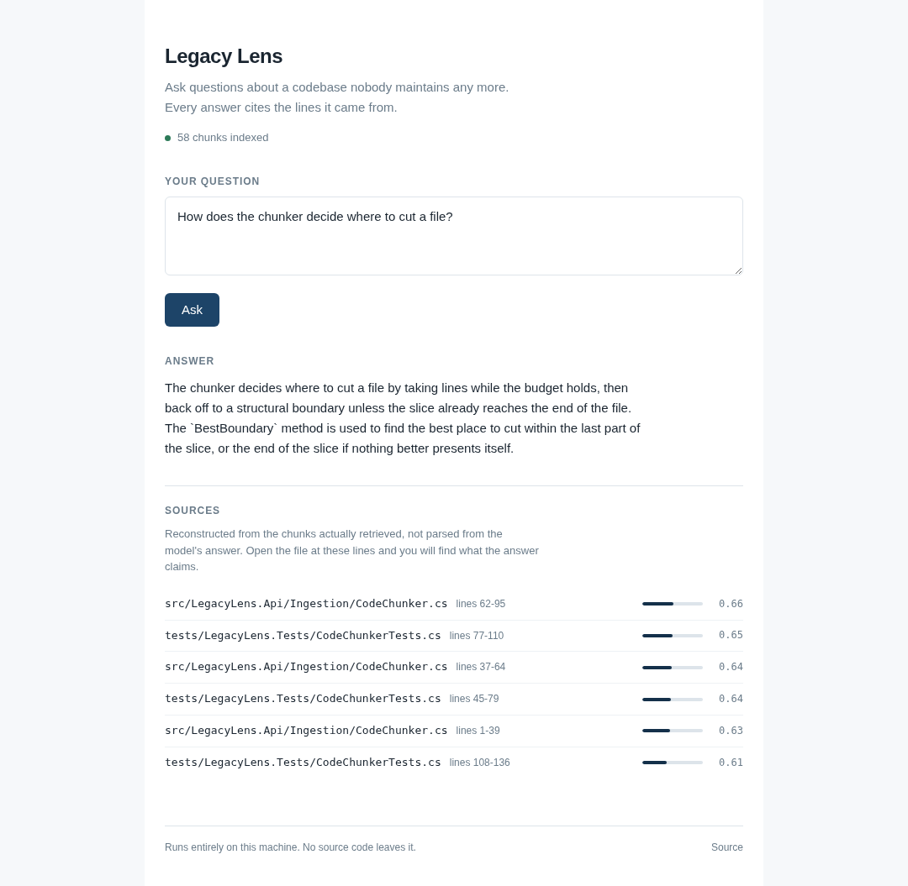
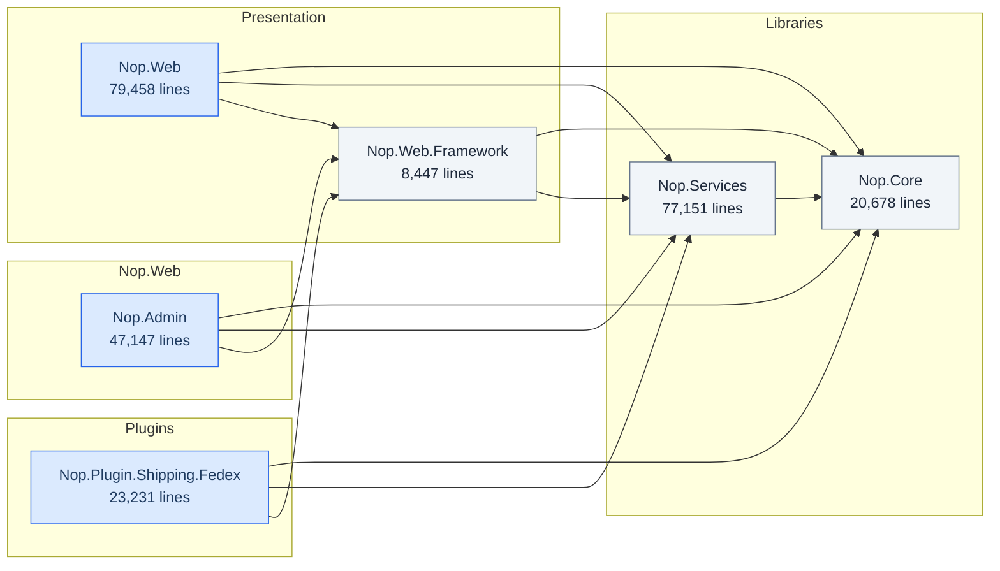

# Legacy Lens

Ask questions about a codebase nobody maintains any more.

Point it at a repository. It reads the source, indexes it, and answers questions
in plain language with a citation for every claim: file and line numbers you can
open and check.



*Answering a question about its own source. Every claim carries the file and lines
it came from, with the retrieval score beside it.*

Or from the command line:

```
> Where is the pricing calculated?

Pricing is computed in Billing/PriceEngine.cs (lines 84-131). The base rate comes
from the customer tier, then two discounts are applied in sequence: volume, then
contractual. The contractual discount is read from an XML file loaded at startup
in Startup.cs:47, which is why changing it requires a restart.

  Billing/PriceEngine.cs:84-131   (0.81)
  Billing/DiscountRules.cs:12-58  (0.74)
  Startup.cs:40-52                (0.69)
```

**Everything runs on your own machine.** The model is local. No source code is
sent to a third-party API. That is not a feature of the demo. It is the reason
this exists. No manufacturer is going to upload the control software for their
machines to a cloud provider.

---

## Why the citations matter

A language model asked about code it has not seen will produce a fluent,
confident, wrong answer. Retrieval-augmented generation exists to stop that: the
model only sees excerpts actually pulled from your repository, and every claim
carries the file and lines it came from.

If the answer looks wrong, you open the file and see it in ten seconds. That is
the whole design goal: the tool is not asking for trust, it is showing its work.

---

## How it works

```
  repository
      │
      ▼
  SourceWalker ──────►  files worth indexing (skips build output, binaries, vendored code)
      │
      ▼
  CodeChunker  ──────►  chunks that respect code structure, with line numbers kept
      │
      ▼
  EmbeddingClient ───►  a vector per chunk            (Ollama, local)
      │
      ▼
  VectorStore  ──────►  SQLite, on disk
                              │
  question ──► embed ──► cosine similarity ──► top K chunks
                                                    │
                                                    ▼
                                            PromptBuilder
                                                    │
                                                    ▼
                                              ChatClient  (Ollama, local)
                                                    │
                                                    ▼
                                            answer + citations
```

### On the vector store

Similarity search is a brute-force cosine scan over every chunk. This is a
deliberate choice, not a shortcut. A repository of 200k lines produces roughly
15-20k chunks; scanning them is a few milliseconds and the index is a single
SQLite file you can copy, inspect, and delete.

Approximate nearest-neighbour indexes (HNSW, IVF) start to pay for themselves
somewhere around a million vectors. Below that they add an dependency, a tuning
surface, and a recall penalty in exchange for nothing.

`IVectorStore` is an interface precisely so that swapping in Qdrant or pgvector
is a new class, not a rewrite. When the numbers justify it.

---

## Mapping a solution

Answering questions needs a model. Understanding the *shape* of a solution does
not, and should not: the project files and the folder layout state it outright.

```bash
curl -X POST localhost:8080/api/map \
     -H 'content-type: application/json' \
     -d '{"path":"/repos/my-solution","minimumLines":3000}'
```

No compilation, no NuGet restore, no MSBuild. That is the point. The moment you
most need to understand an inherited solution is the moment it does not build,
because a package is gone or the SDK is not installed. Tools built on the
compiler are useless exactly when they would help.

### What it produces

Run against [nopCommerce 3.90](https://github.com/nopSolutions/nopCommerce), an
ASP.NET MVC application on .NET Framework 4.5: **31 projects, 2005 files,
300,073 lines, analysed in 219 ms.**



Alongside the diagram, the findings:

| Finding | Count | Example |
|---|---|---|
| Untested | 20 | No test project references `Nop.Plugin.Payments.PayPalStandard` |
| Oversized | 5 | `Nop.Web` holds 79,458 lines in one project |
| Library coupled to web | 4 | `Nop.Core` depends on `System.Web.Mvc` |
| Orphan | 1 | Nothing references `Nop.Plugin.ExchangeRate.EcbExchange` |

The third one is the interesting kind. A library named Core that depends on
`System.Web.Mvc` cannot be unit tested without a web context and cannot be
reused from a service or a desktop client. Nothing about the file layout says
so; nothing about the build complains. It surfaces the day someone tries.

### What it refuses to guess

Project kind is decided by what sits in the folder, not by which assemblies are
referenced. Assembly references lie: `Nop.Core` references `System.Web.Mvc` and
is a class library all the same. A `web.config` next to a `Views` folder does
not lie.

That distinction is the rule the whole analysis follows:

> **The tool never guesses what it can measure.**
> The project files and git supply the facts. The model turns them into
> sentences, and never the other way round.

---

## Running it

Requirements: Docker, and roughly 6 GB of free RAM for the generation model.

```bash
cp .env.example .env
docker compose up -d
docker compose exec ollama ollama pull nomic-embed-text
docker compose exec ollama ollama pull qwen2.5-coder:3b
```

Index a repository:

```bash
curl -X POST localhost:8080/api/ingest \
     -H 'content-type: application/json' \
     -d '{"path":"/repos/my-project"}'
```

Ask it something:

```bash
curl -X POST localhost:8080/api/ask \
     -H 'content-type: application/json' \
     -d '{"question":"Where is authentication handled?"}'
```

Mount the repository you want to index by editing the `repos` volume in
`docker-compose.yml`.

### The web interface

```bash
cd web
npm install
npm start
```

Then open `http://localhost:4200`. The API allows that origin by default; change
`CORS_ORIGIN` if you serve the frontend from somewhere else.

Angular 22, standalone components, signals for local state, reactive forms for
the question. It talks to the same HTTP API as the curl commands above, so
neither side knows about the other beyond the JSON contract.

### Choosing models

| Model | Size | Notes |
|---|---|---|
| `nomic-embed-text` | 274 MB | Embeddings. Fast on CPU, no reason to change it. |
| `qwen2.5-coder:1.5b` | ~1 GB | Generation on a constrained machine. Noticeably weaker. |
| `qwen2.5-coder:3b` | ~2 GB | Generation. The default. |
| `qwen2.5-coder:7b` | ~4.7 GB | Generation. Better, needs the RAM to match. |

Embedding is cheap and stays local in every configuration. Generation is the
expensive half, so `IChatClient` has an OpenAI-compatible implementation for
machines that cannot host a model, at the cost of the privacy guarantee above.
Set `CHAT_PROVIDER=openai` only when that trade is acceptable.

---

## Development

```bash
dotnet test                                   # 45 tests, no network, ~100 ms
dotnet run --project src/LegacyLens.Api

cd web && npm test                            # 5 tests, no network, ~1 s
```

Requires the .NET 10 SDK and Node 20+.

---

## Status

Working, in two halves.

**Structural analysis** reads project files and folder layout, involves no model
at all, and answers in milliseconds: 300,000 lines of nopCommerce in 219 ms.

**Question answering** needs an index and a local model. 77 unit tests covering every layer, no network, no model, 100 ms for
the suite, and the pipeline has been run end to end against a real repository:
this one.

Indexing its own 21 source files produced 58 chunks in 48 seconds on a laptop
CPU, and it answers questions about itself correctly, citing lines that hold
what the answer claims.

The retrieval floor was set by measurement rather than intuition, the method
and the numbers are in `Retriever.MinimumScore`. On seven questions it now
answers the four that the code covers and declines the three it does not.

Known gaps for the question-answering half, in order of impact: no lexical search alongside the vector search,
no streaming, no persistence. See [docs/NEXT.md](docs/NEXT.md) for the detail,
and [docs/ROADMAP.md](docs/ROADMAP.md) for where this is going.

## Licence

MIT
